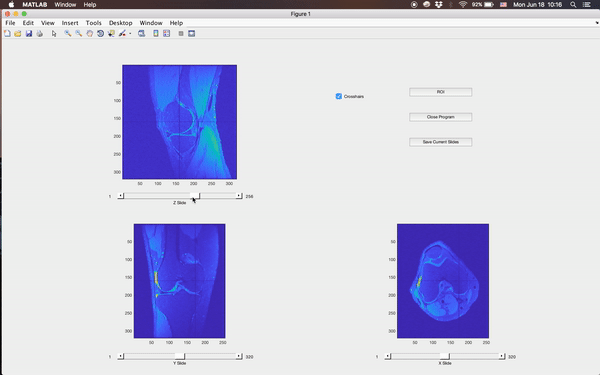

# 3D data visualization
GUI in Matlab to quickly and easily visualize and save important 2D slices from a 3D data cube.

This GUI was primarily created to visualize MRI data. It is a redesign of a function used by 
professor Charles DiMarzio at Northeastern University named 'hsi4'. Below is a demonstration of the primary use case:

## Special Features

### Quick and easy
> run from the Matlab command line

Only 1 input: the 3-dimensional data cube.

### Region of Interest (ROI) selection
> click the `ROI` button

Returns the values of the 2D slice to the variable `BW`, with all values outside the ROI set to zero, allowing further calculations on the specified region.

### Create figures for presentation
> click the `Save Current Slides` button

Prints well-labeled and nicely oriented figures of the currently chosen 2D slices. The crosshairs are not included even if selected when the button is pressed.

### Crosshairs ON/OFF
> select or deselect the `Crosshairs` checkbox

You can turn crosshairs on and off so they aren't in the way. May be useful when the resolution is poor and crosshairs can obstruct part of the view.

